<h2>Partie Frontend</h2>
<h4>Créer des composants (accounts, customer-accounts,customers)</h3>
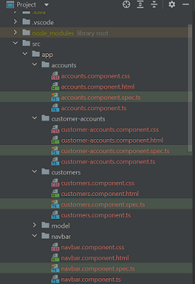
<h4>Configurer le systeme de routage</h4>
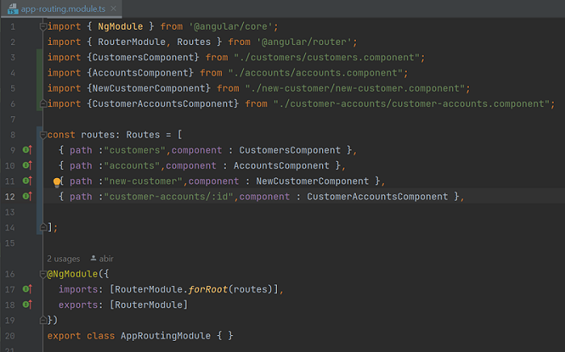
<h4>La communication avec le backend</h4>
<li>importer le module HttpClientModule</li>
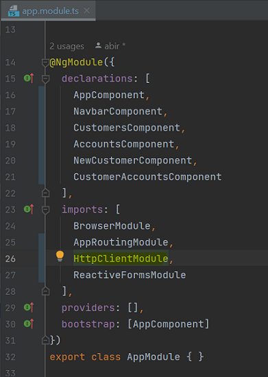
<h4>l'interface web (digital-banking-web)</h4>
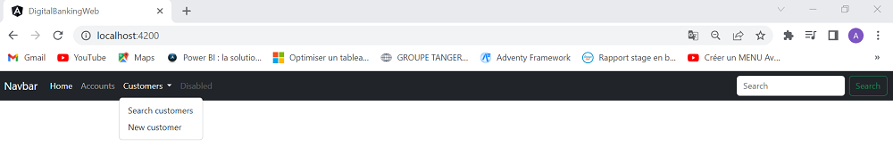
<h4>La listes des clients</h4>

cette partie liste les clients existants, accompagnée d'un champ de recherche pour filtrer par mots-clés.Chaque client est présenté, avec des détails tels que  ID, nom et adresse e-mail

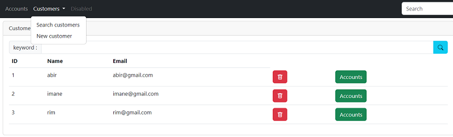
<h4>Recherche des clients par mot-clé</h4>
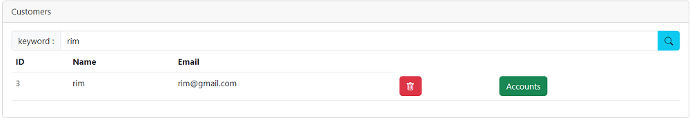
<h4>Ajouter un client</h4>
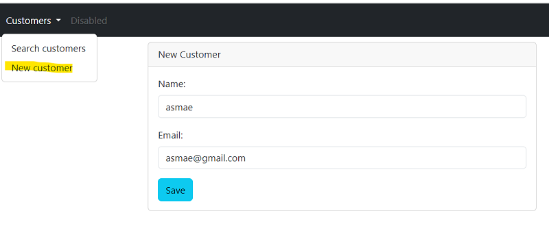

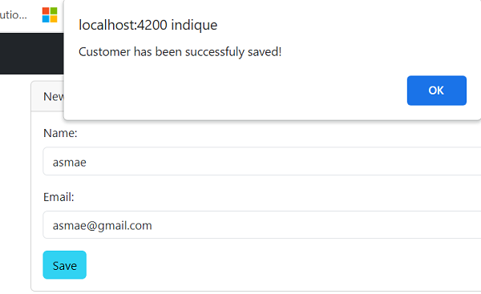
<h4>Afficher les informations d'un compte</h4>
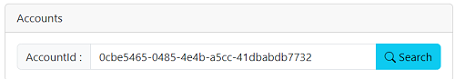

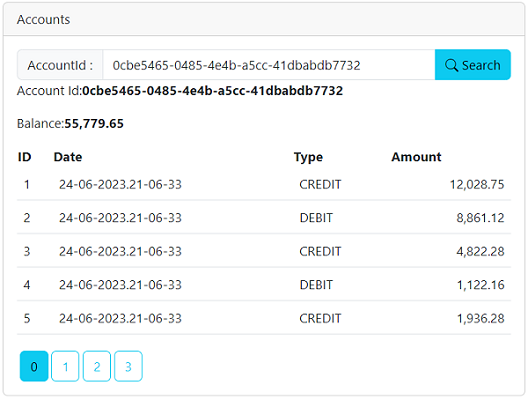

cette partie permet à l'utilisateur d'effectuer des opérations (le débit, le crédit et le transfert)

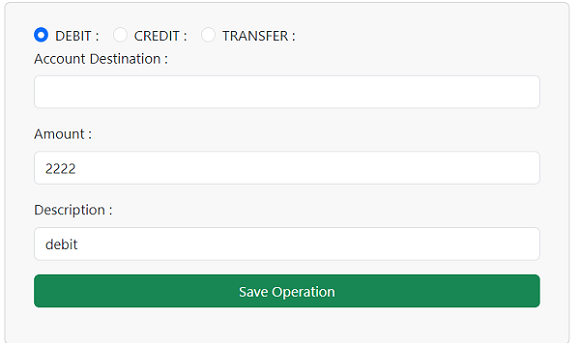
